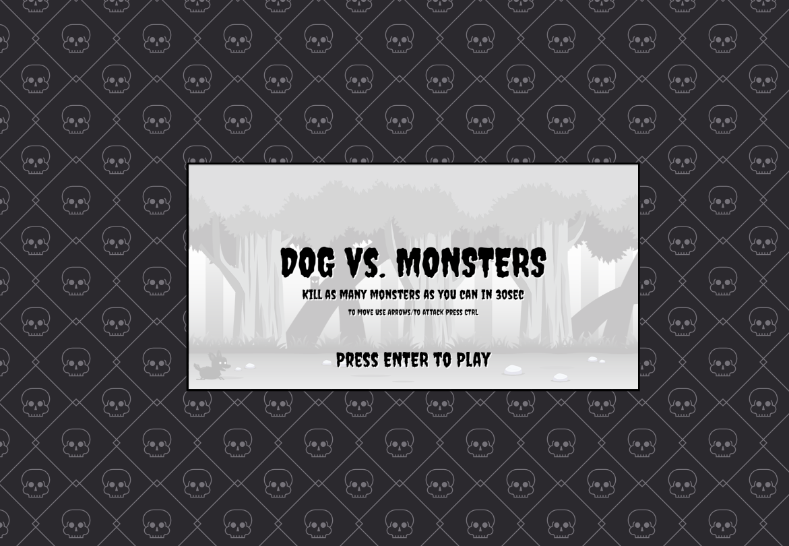
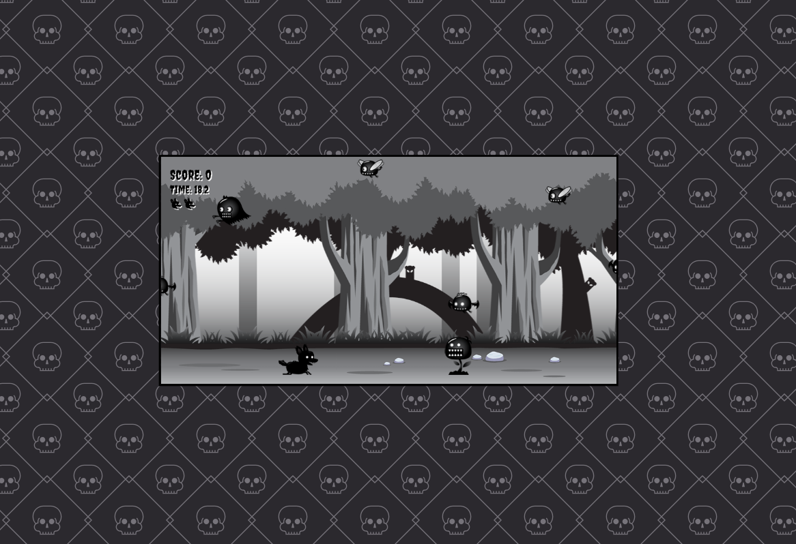

# Dog Runner 2D Game

This repository contains a simple 2D platformer game built using JavaScript . In this game, you control an adorable dog as it navigates through level with different enemies.

## Demo

Play the game now by accessing the live demo [here](https://pawelslatwyezcky.github.io/dogrunner2dgame/)!

## Gameplay

- Use the arrow keys (up, down, left, right) or the WASD and Ctrl keys to control the dog's movement and attack.
- Jump over obstacles and avoid hazards to keep the dog safe.
- Achieve maximum score in 30 seconds.

## Features

- **Engaging Levels:** Enjoy a series of well-designed levels with increasing difficulty and unique obstacles.
- **Score Tracking:** Keep track of your score as you collect bones throughout the game.
- **Lives System:** Start with a set number of lives and be careful not to lose them all by colliding with obstacles or falling off platforms.
- **Responsive Controls:** The game controls are designed to be responsive and provide smooth gameplay.
- **Endless Fun:** Challenge yourself to achieve high scores or replay levels to improve your performance.

## Screenshots

## Getting Started

To get started with Dog Runner 2D Game, follow these steps:

1. Clone the repository to your local machine using `git clone https://github.com/pawelslatwyezcky/dogrunner2dgame.git`.
2. Open the project in your preferred code editor.
3. Start live server (js type is module).

## Technologies Used

- JavaScript
- HTML5 Canvas

## Contributing

Contributions to this project are welcome! If you have any suggestions, improvements, or find any issues, please feel free to submit a pull request.

## Acknowledgements

This Game is created for mastering Canvas with youtube channel [Franks laboratory](https://www.youtube.com/@Frankslaboratory).
